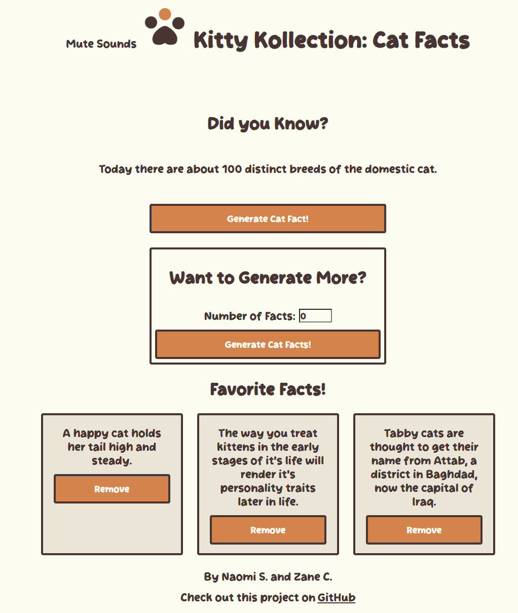
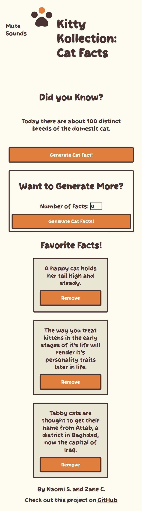

# mod-4-project

# 🐱 Kitty Kollection: Cat Facts

A fun and interactive web application that lets users generate random cat facts, and save your favorites. Built with vanilla JavaScript and powered by the meowfacts API.

---

## 🔗 Live Link

[View the live site](https://naomi-zane-mls.github.io/mod-4-project/)

---

## 👥 Team Members

- **Zane C.**
- **Naomi S.**

---

## 🌐 API

**Cat Facts API** — [https://meowfacts.herokuapp.com](https://meowfacts.herokuapp.com)

| Endpoint                             | Description                              |
| ------------------------------------ | ---------------------------------------- |
| `GET /fact`                          | Returns a single random cat fact         |
| `GET /facts?limit={n}`               | Returns an array of `n` random cat facts |
| `GET /facts?limit={n}&locale={lang}` | Returns facts in a specified language    |

---

## ✅ Features

### MVP

- Generate a single random cat fact with one click
- Input a number and generate that many facts at once
- Favorite individual facts, which are saved to localStorage and displayed on the page

### Stretch Features

- Toggle sound effects for actions like generating and saving facts

---

## 🛠 Tech Stack

- HTML5
- CSS3 (CSS Grid, custom properties, media queries)
- JavaScript (ES6 modules, async/await, localStorage)
- [Cat Facts API](https://meowfacts.herokuapp.com)
- Vite (dev server + bundler)

---

## ✨ AI Usage Document

This project provided us an opportunity to build something with AI assistance. Check out our [AI Usage Document](https://docs.google.com/document/d/1dPP0-DGIHHNuis0p75gy_gcvOWyxynNS2V-O18kEYD4/edit?usp=sharing) to see how we used AI on this project.

---

## ⚙️ Setup Instructions

1. Clone the repository:

   ```bash
   git clone https://github.com/Naomi-Zane-mls/mod-4-project.git
   cd mod-4-project
   ```

2. Install dependencies:

   ```bash
   npm install
   ```

3. Start the development server:

   ```bash
   npm run dev
   ```

4. Open your browser and navigate to `http://localhost:5173`

---

## 📸 Screenshots
| Desktop View  | Mobile View  |
| ------------- | ------------ |
|  |  |
